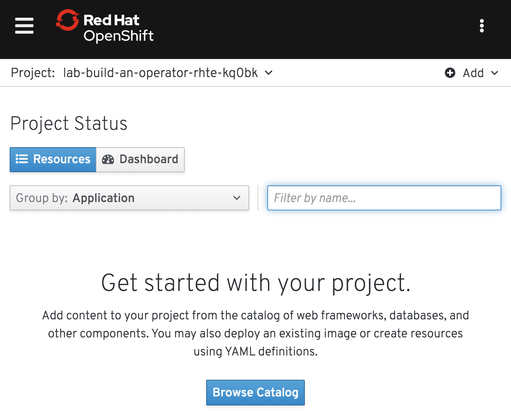

In this first set of exercises you will install an `etcd` cluster into your project. You will do this by using an operator for `etcd`. This operator was installed from the OperatorHub in advance of the workshop. This is a step that can only be done if you are a cluster admin. For this workshop you do not have cluster admin rights, so the installation will be skipped. We will show the steps the cluster admin would need to have done at the end of this set of exercises.

To see what operators may already have been installed into a cluster and which are available for you to use in your project, you can view them by visiting "Installed Operators" in the web console.

Click on the "Console" tab in the workshop environment to bring up the web console in place of the terminal. You should be presented with the list of projects you have access to, which for this workshop should only be the `%project_namespace%` project.


If you don't see the list of projects, click on "Home->Projects" in the left hand menu of the web console. If the left hand menu is not visible, you can expose it by clicking on the hamburger menu on the left side of the web console banner. Alternatively click on this [projects](%console_url%/k8s/cluster/projects)&nbsp;<span class="fas fa-window-restore"></span> link.

With the list of projects visible, it is important to click on the name of your project so that the web console uses it as the context for subsequent steps.

This should bring you to the [overview](%console_url%/overview/ns/%project_namespace%)&nbsp;<span class="fas fa-window-restore"></span> page for the project.



Now select "Catalog->Installed Operators" from the left hand menu. This should bring up the list of [installed operators](%console_url%/k8s/ns/%project_namespace%/clusterserviceversions)&nbsp;<span class="fas fa-window-restore"></span>.


It is possible that you may see other operators which have been enabled and are available. It will depend on what the cluster admin has setup.

The list of installed operators, and what you can do with them through the web console, is determined from the instances of the `clusterserviceversion` resources which exist in a project. You can query them from the command line by running:

```execute
oc get clusterserviceversions
```
